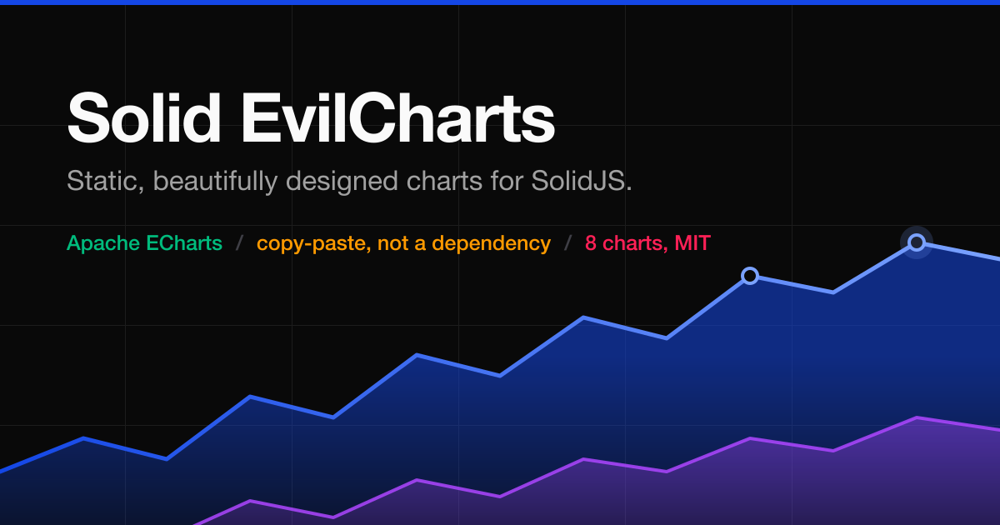

<p align="center">
  
</p>

<h1 align="center">Solid EvilCharts</h1>

<p align="center">
  Static, beautifully designed charts for <b>SolidJS</b>, powered by
  <a href="https://echarts.apache.org/">Apache ECharts</a>.<br>
  <a href="https://solid-evilcharts.pages.dev"><b>Documentation &amp; live demos →</b></a>
</p>

---

> ### Credit where it's due
>
> This project is a SolidJS port of **[EvilCharts](https://evilcharts.com)** by
> [Gurbinder](https://github.com/gurbinder), used under the MIT license. The chart designs,
> variants, component API, and a great deal of the option-building logic originate there.
>
> If you write React, **use the original** — it's excellent, and it's the upstream this
> project follows.

## Install

Charts are distributed like shadcn/ui components: the CLI copies the source into your
project and it is yours from then on. No runtime package, no version to keep in step.

```bash
npm install echarts
npx shadcn@latest add thesambayo/solid-evilcharts/line-chart
```

Do **not** run `shadcn init` — it is React-only and will overwrite `src/lib/utils.ts`.
Write `components.json` by hand instead; the
[installation guide](https://solid-evilcharts.pages.dev/docs/installation) has the file to
copy.

## Charts

Eight, each with its own docs page and a live demo:

|                                                                           |                                                       |
| ------------------------------------------------------------------------- | ----------------------------------------------------- |
| [Line](https://solid-evilcharts.pages.dev/docs/charts/line-chart)         | Strokes, dots, brush, buffer tail, glow, hover reveal |
| [Area](https://solid-evilcharts.pages.dev/docs/charts/area-chart)         | Seven fills, stacking, 100% stacks                    |
| [Bar](https://solid-evilcharts.pages.dev/docs/charts/bar-chart)           | Eight fills, layout swap, max-value highlighting      |
| [Composed](https://solid-evilcharts.pages.dev/docs/charts/composed-chart) | Bars and lines on shared axes                         |
| [Pie](https://solid-evilcharts.pages.dev/docs/charts/pie-chart)           | Sectors, donuts, labels, 11 backgrounds               |
| [Radial](https://solid-evilcharts.pages.dev/docs/charts/radial-chart)     | Polar bars, gauges, semi arcs                         |
| [Radar](https://solid-evilcharts.pages.dev/docs/charts/radar-chart)       | One polygon per series, polygon or circular grids     |
| [Sankey](https://solid-evilcharts.pages.dev/docs/charts/sankey-chart)     | Flow diagram with a column-by-column intro cascade    |

Plus the shared parts they are built from —
[tooltip](https://solid-evilcharts.pages.dev/docs/ui/tooltip),
[legend](https://solid-evilcharts.pages.dev/docs/ui/legend),
[dots](https://solid-evilcharts.pages.dev/docs/ui/dots),
[brush](https://solid-evilcharts.pages.dev/docs/ui/brush).

## Status

**Working, not yet 1.0.** All eight charts are ported and installable, the docs site is
live, and the suite is 686 tests green. The API can still change — nothing is tagged yet,
so pin by reading the source you installed.

Known gaps, honestly: nothing canvas-only (pattern fills, glows, gradient strokes) is
verified by machine, and a second rendering engine
([TanStack Charts](https://tanstack.com/charts)) is deferred until it reaches beta.

## Stack

- **SolidJS** 1.9 · **Apache ECharts** 6 (modular `echarts/core`, canvas + SVG renderers)
- **Vite** 8 + **TanStack Solid Router** · **Tailwind** 4 + **Ark UI** for the docs chrome
- **oxlint** / **oxfmt** · **Vitest**

## Develop

```bash
pnpm install
pnpm dev      # http://localhost:9501
pnpm test     # vitest
pnpm build    # vite build + per-route <head> + tsc --noEmit
pnpm lint
```

`src/registry/` is the subtree that ships — nothing in it may import outside it, and
`boundary.test.ts` enforces that. Everything else is the docs app.

### Node version

`.node-version` pins 24.12.0, and `engines` sets the real floor at **22.18.0**.

That floor is not arbitrary: `scripts/build-seo.mts` imports `../src/lib/seo.ts` and two
other `.ts` files directly, so `node` has to strip the types itself. Native type stripping
only became unflagged in 22.18.0 — on anything older the build dies at
`ERR_UNKNOWN_FILE_EXTENSION: Unknown file extension ".mts"`, which names the entry file and
says nothing about the Node version that actually caused it.

### Formatting

`pnpm fmt` runs [oxfmt](https://oxc.rs) at 90 columns over `.ts`/`.tsx`/`.mts` only.
`.oxfmtrc.jsonc` documents why it is scoped that way — in short, the MDX docs tables, the
CSS token file and the generated `registry.json` are all hand- or machine-maintained and
oxfmt would rewrite them unhelpfully. Formatting `registry.json` in particular turns
`pnpm test` red, because `registry.test.ts` compares it against its generator.

The repo has never been fully formatted, so the first `pnpm fmt` will touch ~80 files.
Run it on a clean tree and commit it on its own, or it buries whatever else you were
working on.

## License

MIT — see [LICENSE](./LICENSE). Retains the upstream EvilCharts copyright.
